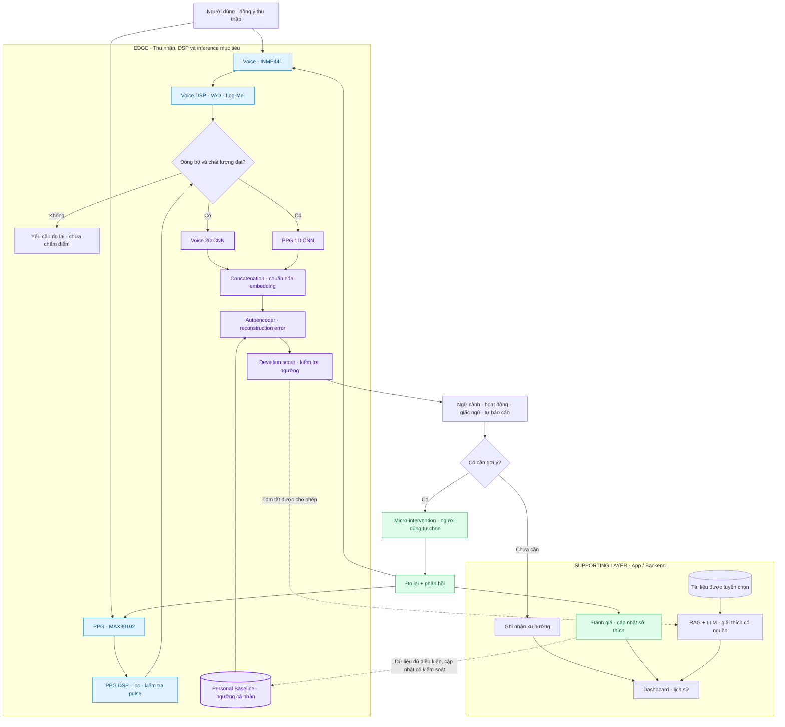
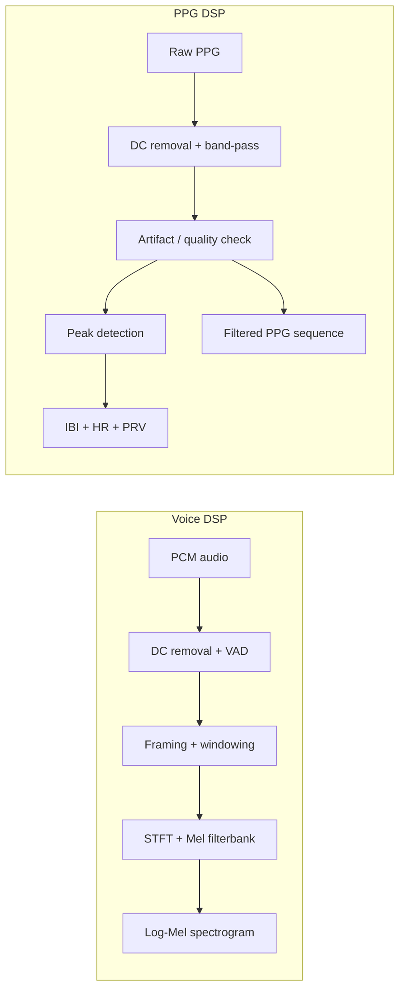
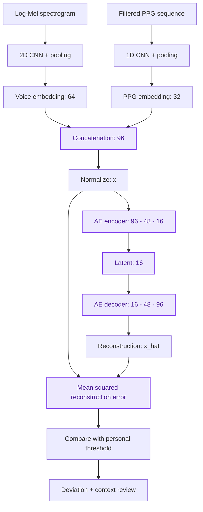
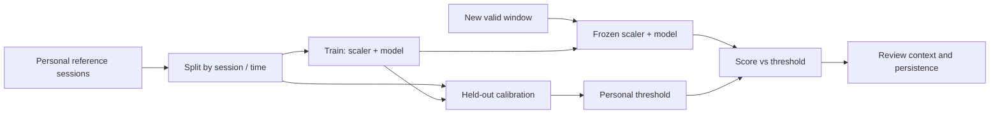
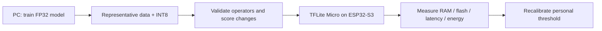
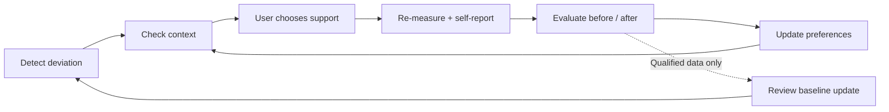
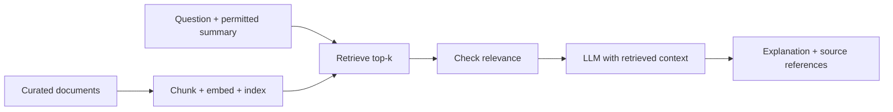

# MindPulse
**Personalized Multimodal Mental Wellness Edge AI**

[Overview](#lý-do-chọn-đề-tài-và-mục-tiêu) · [Workflow](#workflow) · [DSP](#voice--ppg-dsp) · [AI](#ai-architecture) 

MindPulse là dự án nghiên cứu hệ thống Edge AI kết hợp **giọng nói (Voice) và PPG** để học trạng thái nền của từng người và phát hiện những thay đổi đáng chú ý theo thời gian. Bài toán trung tâm là **Personalized Multimodal Anomaly Detection**: trạng thái hiện tại khác baseline của chính người dùng đến mức nào?

**Trạng thái:** thiết kế và lộ trình nghiên cứu. Các kiến trúc, cấu hình và công nghệ dưới đây là định hướng triển khai; chưa phải tuyên bố về tính năng đã hoàn thành hoặc hiệu năng đã được kiểm chứng.

## Lý do chọn đề tài và mục tiêu

Baseline sinh lý và hành vi khác nhau giữa các cá nhân. Voice và PPG cung cấp hai góc quan sát bổ sung, nhưng đều chịu ảnh hưởng của điều kiện đo và ngữ cảnh. MindPulse chọn so sánh người dùng với chính họ, kết hợp kiểm tra chất lượng tín hiệu và phản hồi để nghiên cứu khả năng giảm cảnh báo sai.

- Thu thập, đồng bộ và xử lý Voice + PPG; loại các cửa sổ không đủ chất lượng.
- Học biểu diễn đa phương thức và baseline cá nhân; đối chiếu deep learning với các thuật toán thống kê/ML.
- Chạy DSP và mô hình phù hợp trên Edge; đo RAM, bộ nhớ model, độ trễ và năng lượng thực tế.
- Đề xuất hỗ trợ wellness nhẹ theo ngữ cảnh, đo lại và học từ phản hồi.
- Dùng RAG/LLM để giải thích có nguồn tham chiếu, tách khỏi bộ phát hiện sai lệch.

## Workflow

Một luồng chính từ tín hiệu đến phản hồi; RAG/LLM là nhánh hỗ trợ tùy chọn.

## 5 technical cores

| Core | Trọng tâm kỹ thuật | Đầu ra |
|---|---|---|
| **1. Signal Processing** | Voice/PPG DSP, đồng bộ thời gian, signal quality | Cửa sổ tín hiệu hợp lệ và đặc trưng |
| **2. Multimodal Representation** | Voice 2D CNN + PPG 1D CNN, concatenation | Embedding kết hợp |
| **3. Personalized Anomaly Detection** | Personal baseline, Autoencoder, benchmark thống kê/ML | Mức sai lệch và ngưỡng cá nhân |
| **4. Edge AI / TinyML** | INT8, tối ưu bộ nhớ, kiểm tra operator và độ trễ | Inference phù hợp tài nguyên thiết bị |
| **5. Closed-loop Personalization** | Ngữ cảnh, micro-intervention, đo lại, feedback | Lịch sử phản hồi và cá nhân hóa có kiểm soát |

## Voice / PPG DSP

| Nhánh | Pipeline dự kiến | Biểu diễn và đặc trưng |
|---|---|---|
| **Voice** | PCM mono 16 kHz; loại DC, VAD, chia frame 25 ms / hop 10 ms, windowing, STFT, Mel filterbank, log | Log-Mel cho CNN; MFCC, pitch, energy, pause duration cho benchmark |
| **PPG** | Timestamp, loại DC, band-pass phù hợp tần số lấy mẫu, phát hiện artifact, peak detection và kiểm tra IBI | Chuỗi PPG đã lọc cho CNN; HR, RMSSD, SDNN, pulse amplitude và signal quality cho benchmark |

Ghép hai modality theo cùng khoảng thời gian quan sát; cửa sổ tính PRV được xác định riêng và kiểm chứng theo độ dài đo. Thiếu một modality hoặc chất lượng thấp thì yêu cầu đo lại, không tự điền dữ liệu để chấm điểm bằng mô hình hai nhánh.

Với thời điểm đỉnh pulse $t_i$ tính bằng giây, đặt $b_i$ là IBI; HR tương ứng có đơn vị nhịp/phút:

$$b_i = t_{i+1}-t_i$$

$$\mathrm{HR}_i=\frac{60}{b_i}.$$

Với $N$ khoảng pulse hợp lệ và $\bar b$ là trung bình của chúng:

$$\mathrm{RMSSD}=\sqrt{\frac{1}{N-1}\sum_{i=1}^{N-1}(b_{i+1}-b_i)^2}$$

$$\mathrm{SDNN}_{\mathrm{PPG}}=\sqrt{\frac{1}{N-1}\sum_{i=1}^{N}(b_i-\bar b)^2}.$$

RMSSD và SDNN ở đây tính bằng giây; nhân 1000 khi báo cáo bằng ms. Đây là các chỉ số **PRV từ PPG**, không mặc nhiên tương đương HRV từ ECG; ký hiệu SDNN được dùng theo cách tính tương tự trên các khoảng pulse đã kiểm tra chất lượng.

## AI architecture

Cấu hình khởi đầu dưới đây là đề xuất để thử nghiệm, chưa phải cấu hình tối ưu trên ESP32-S3.

| Thành phần | Kiến trúc đề xuất |
|---|---|
| **Voice encoder** | Log-Mel 64 bins; 2 khối Conv2D + ReLU + MaxPool; Global Average Pooling; Dense tạo embedding 64 chiều |
| **PPG encoder** | Chuỗi PPG một kênh; 2 khối Conv1D + ReLU + MaxPool; Global Average Pooling; Dense tạo embedding 32 chiều |
| **Fusion** | Concatenation thành 96 chiều; chuẩn hóa bằng thống kê của tập train |
| **Autoencoder** | Dense 96 → 48 → 16 → 48 → 96; ReLU ở lớp ẩn, đầu ra tuyến tính; reconstruction MSE |

Với $u$ là người dùng, $t$ là cửa sổ đo, $X^{(v)}_{u,t}$ là Log-Mel và $X^{(p)}_{u,t}$ là chuỗi PPG:

$$\mathbf{h}_{u,t}^{(v)}=f_v(X^{(v)}_{u,t})$$

$$\mathbf{h}^{(p)}_{u,t}=f_p(X^{(p)}_{u,t})$$

$$\mathbf{h}_{u,t}=\mathrm{concat}\left(\mathbf{h}^{(v)}_{u,t},\mathbf{h}^{(p)}_{u,t}\right).$$

Gọi $\mathbf{x}_{u,t}$ là embedding sau chuẩn hóa, $d=96$ và $\hat{\mathbf{x}}_{u,t}=g_\phi(f_\theta(\mathbf{x}_{u,t}))$ là đầu ra Autoencoder:

$$E_{u,t}=\frac{1}{d}\left\lVert\mathbf{x}_{u,t}-\hat{\mathbf{x}}_{u,t}\right\rVert_2^2$$

$$\mathcal{L}_{\mathrm{AE}}=\frac{1}{M}\sum_{(u,t)\in\mathcal{B}_{\mathrm{train}}}E_{u,t}.$$

$\mathcal{B}_{\mathrm{train}}$ gồm $M$ cửa sổ baseline dành cho huấn luyện. Hai CNN cần được pretrain bằng mục tiêu representation learning có kiểm chứng rồi đóng băng khi train Autoencoder; không chỉ tối ưu reconstruction trên embedding với cả hai encoder tự do, vì có nguy cơ embedding suy biến. Dữ liệu và mục tiêu pretraining là hạng mục cần hoàn thiện trong roadmap.

## Personal Baseline và benchmark

Baseline là trạng thái tham chiếu cá nhân, **không phải nhãn “khỏe mạnh”**. Thu dữ liệu qua nhiều phiên và ngữ cảnh, giữ riêng tập train, tập calibration và tập test theo thời gian. Chỉ phát cảnh báo khi đủ dữ liệu tham chiếu và chất lượng đo; không dùng ngưỡng chung tùy ý cho mọi người.

Với vector đặc trưng $\mathbf{x}_{u,t}$, mean $\boldsymbol{\mu}_u$ và độ lệch chuẩn $\sigma_{u,j}$ học từ baseline, Z-score của đặc trưng $j$ là:

$$z_{u,t,j}=\frac{x_{u,t,j}-\mu_{u,j}}{\max(\sigma_{u,j},\epsilon)}.$$

$\epsilon>0$ là sàn số học. Mahalanobis xét tương quan giữa các đặc trưng; dùng covariance regularization với $\lambda>0$ để hạn chế ma trận suy biến:

$$D_{M,u}(\mathbf{x})= \sqrt{(\mathbf{x}-\boldsymbol{\mu}_u)^\top (\mathbf{\Sigma}_u+\lambda\mathbf{I})^{-1} (\mathbf{x}-\boldsymbol{\mu}_u)}.$$

Ngưỡng Autoencoder được hiệu chỉnh trên **baseline calibration giữ riêng** của người dùng:

$$\tau_u=Q_{1-\alpha}\left(\{E_{u,t}:t\in\mathcal{B}_{u,\mathrm{cal}}\}\right)$$

$$E_{u,t}>\tau_u.$$

$Q_{1-\alpha}$ là phân vị thực nghiệm; $\alpha$ là mức đuôi dùng khi calibration, không đảm bảo tỷ lệ cảnh báo sai ngoài thực tế. Vượt ngưỡng chỉ đánh dấu sai lệch để xem xét thêm chất lượng, độ kéo dài và ngữ cảnh; reconstruction error không phải xác suất mắc rối loạn tâm thần.

| Thuật toán | Vai trò benchmark | Điểm cần kiểm tra |
|---|---|---|
| **Z-score** | Baseline đơn giản; tổng hợp bằng max trị tuyệt đối theo feature | Outlier, feature tương quan, nhiều phép kiểm tra |
| **Mahalanobis** | Sai lệch đa biến có covariance | Số mẫu, regularization, chiều đặc trưng |
| **Isolation Forest** | Phát hiện vùng thưa bằng phân hoạch ngẫu nhiên | Hyperparameter, calibration, chi phí inference |
| **One-Class SVM** | Học ranh giới baseline | Scaling, kernel, số support vector |
| **Autoencoder** | Học cấu trúc phi tuyến của embedding đa phương thức | Overfitting, embedding collapse, dữ liệu baseline |

So sánh trên cùng phân chia dữ liệu và điều kiện calibration; báo cáo false alarms theo thời gian, độ ổn định giữa phiên, RAM và latency. Chỉ báo cáo precision/recall, F1 hoặc AUROC khi có nhãn đánh giá phù hợp; so sánh Voice-only, PPG-only và fusion để đo đóng góp từng nhánh. Mô hình dùng cho người mới cần được đánh giá bằng phân chia theo người dùng, tránh rò rỉ giữa các cửa sổ cùng phiên.

## Edge AI / TinyML

Training và calibration thực hiện trên máy phát triển. Thiết bị hướng tới thu nhận tín hiệu, DSP và inference offline; backend quản lý lịch sử, phiên bản model và các chức năng hỗ trợ. Khả năng chạy toàn bộ CNN + Autoencoder trên ESP32-S3 phải được chứng minh bằng profiling; bắt đầu từ benchmark thống kê và mô hình nhỏ.

INT8 quantization ánh xạ giá trị thực $r$ sang số nguyên $q$, với scale $s>0$ và zero-point $z_0$:

$$q=\mathrm{clip}\left(\mathrm{round}(r/s)+z_0,-128,127\right)$$

$$\hat r=s(q-z_0).$$

Dùng dữ liệu đại diện để calibration, kiểm tra operator được runtime hỗ trợ, peak RAM/tensor arena, flash, latency và năng lượng. So sánh FP32 với INT8 và hiệu chỉnh lại ngưỡng bằng mô hình đã lượng tử hóa vì reconstruction error có thể thay đổi. Ưu tiên xử lý local; dữ liệu gửi đi phải tối thiểu và có sự đồng ý của người dùng.

## Closed-loop feedback

Decision engine khởi đầu bằng luật dựa trên mức sai lệch, ngữ cảnh, sở thích và lịch sử. Người dùng có thể chọn hoặc bỏ qua gợi ý như nghỉ ngắn, thở thư giãn hay ghi chú cảm nhận. Sau đó hệ thống đo lại trong điều kiện tương đương và thu phản hồi chủ quan.

Reward thử nghiệm dùng cùng model, baseline và thang điểm cố định trong cặp đo trước/sau:

$$R_{u,t}=D_{u,\mathrm{before}}-D_{u,\mathrm{after}}.$$

$D$ là điểm sai lệch trên thang cố định, có thể dùng trực tiếp reconstruction error $E$ cho prototype. Reward dương chỉ cho thấy điểm giảm, không chứng minh hiệu quả lâm sàng hay quan hệ nhân quả. Feedback giúp điều chỉnh xếp hạng gợi ý; cập nhật baseline cần dữ liệu đủ chất lượng, kiểm soát drift, lưu phiên bản và khả năng rollback, tránh tự hấp thụ mọi sai lệch kéo dài vào baseline.

## RAG / LLM — supporting layer

RAG truy xuất tài liệu wellness đã tuyển chọn; LLM giải thích xu hướng và nội dung hỗ trợ kèm nguồn. Nhánh này chạy trên app/backend và không quyết định anomaly score, ngưỡng hoặc chẩn đoán.

Với embedding truy vấn $\mathbf{e}_q$ và tài liệu $\mathbf{e}_d$ có norm khác 0:

$$\mathrm{sim}(q,d)= \frac{\mathbf{e}_q^\top\mathbf{e}_d} {\lVert\mathbf{e}_q\rVert_2\,\lVert\mathbf{e}_d\rVert_2}.$$

Truy xuất top-$k$, kiểm tra độ liên quan rồi đưa nguồn vào context. Khi thiếu bằng chứng, hệ thống cần nói rõ giới hạn; chỉ gửi tóm tắt được cho phép, không mặc định truyền raw voice hoặc toàn bộ lịch sử cá nhân.

## Hardware và tech stack

| Lớp | Lựa chọn dự kiến |
|---|---|
| **Edge** | ESP32-S3; C/C++, ESP-IDF/FreeRTOS; TensorFlow Lite Micro |
| **Voice / PPG** | INMP441 qua I2S; MAX30102 qua I2C; timestamp và bộ đệm đồng bộ |
| **DSP / ML** | Python, NumPy, SciPy, librosa, NeuroKit2, scikit-learn |
| **Deep learning** | TensorFlow/Keras cho đường triển khai TFLite; PyTorch có thể dùng nghiên cứu, cần kiểm tra riêng đường chuyển đổi |
| **Backend / storage** | FastAPI, PostgreSQL; BLE/Wi-Fi theo thiết kế kết nối |
| **App** | Streamlit cho prototype; cân nhắc React hoặc Flutter ở giai đoạn sau |
| **RAG** | FAISS hoặc Qdrant, embedding model và LLM được lựa chọn sau |
| **Development** | PC/laptop phục vụ huấn luyện, kiểm thử và profiling |

## Limitations / disclaimer

Voice và PPG chịu ảnh hưởng của chuyển động, tiếp xúc sensor, tiếng ồn, đặc điểm người dùng và ngữ cảnh đo. Thiếu modality, ít dữ liệu baseline, domain shift hoặc baseline drift có thể làm điểm sai lệch không đáng tin cậy. Chưa có kết quả kiểm chứng để suy ra hiệu quả lâm sàng hay cam kết độ chính xác.

MindPulse là dự án nghiên cứu kỹ thuật hỗ trợ **mental wellness**, không phải thiết bị chẩn đoán, công cụ theo dõi khẩn cấp hoặc phương án thay thế chuyên gia sức khỏe tâm thần. Thu thập dữ liệu cần minh bạch, có đồng ý, quyền xóa dữ liệu và kiểm soát truy cập.
